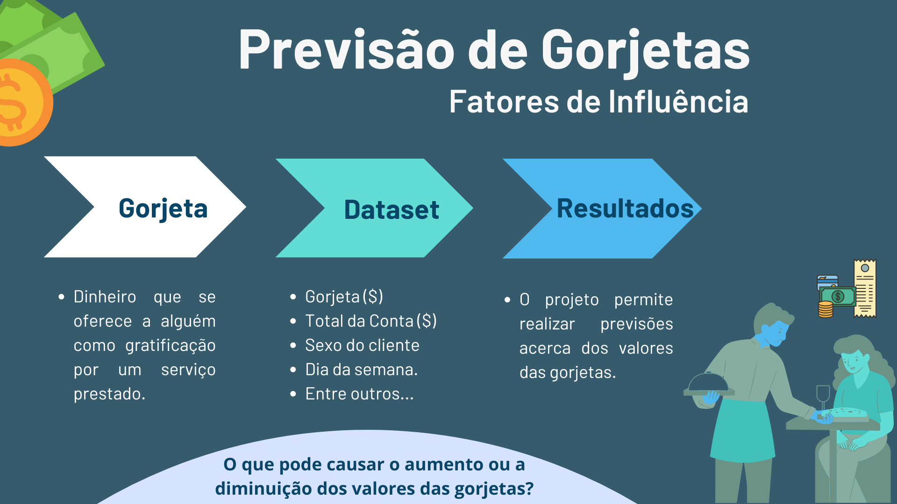

# Previsão de Gorjetas: Fatores de Influência

## Resumo
Este projeto busca melhor compreender se o perfil do cliente, seus hábitos e o contexto em que está inserido no momento da refeição são relevantes para o valor da gorjeta. O conjunto de dados que foi utilizado, [tips: Tipping data](https://rdrr.io/cran/reshape2/man/tips.html), demonstra as diferentes gorjetas recebidas ao longo de alguns meses por um funcionário de um restaurante.  
Por meio dos dados fornecidos, utilizando técnicas de Ciências de Dados, é possível realizar previsões acerca das gorjetas por meio da identificação de padrões e tendências.

## Graphical Abstract

## Desenvolvedor
- [Maria Fernanda Cordeiro](https://github.com/Fernanda-Cordeiro)

---
